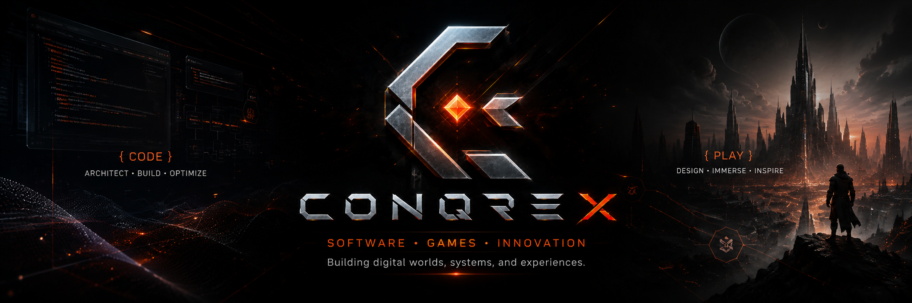

<h3><code>CODE. CREATE. CONQUER.</code></h3>

<b>An independent software &amp; game development studio.</b> 
We build our own engine, our own tooling, our own networking — 
then we build games on top of them.

  
  
  
  

  <a href="https://conqrex.com"><b>Website</b></a> ·
  <a href="https://conqrex.com/engine"><b>Engine</b></a> ·
  <a href="#-open-source"><b>Open Source</b></a> ·
  <a href="https://conqrex.com/about"><b>About</b></a> ·
  <a href="mailto:sancak@conqrex.com"><b>Contact</b></a>

---

## ⚙️ Conqrex.Engine

One C# codebase rendering **2D, 2.5D isometric and 3D** — the foundation under every Conqrex title.

|     |     |
| --- | --- |
| 🌐 **Every surface** | One codebase ships to the browser (Blazor/WASM), mobile (.NET MAUI) and desktop (Windows / macOS / Linux). |
| 🎯 **Deterministic core** | Fixed 30 Hz simulation with fixed-point math; rendering interpolates as fast as the surface allows. |
| 🖼️ **Our own GPU layer** | A WebGPU-first rendering hardware interface, with WebGL2 and native `wgpu` backends behind it. |
| 🔌 **Multiplayer built in** | RPCs, sync types, observers, client prediction and reconciliation — not a bolt-on. |
| 🧰 **Full toolchain** | Entity-component scenes, asset pipeline, input, audio, animation, physics and a desktop visual editor. |

**[→ Meet the engine](https://conqrex.com/engine)**

## 🎮 Games

New titles are in production on Conqrex.Engine's autonomous **GameSpec** pipeline —
specs in, playable builds out. Announcements land at **[conqrex.com](https://conqrex.com)**.

## 🐙 Open source

Tools we built for our own workflow and released for yours.

| Project | What it does |
| --- | --- |
| **[Conqrex.OctoPulse](https://github.com/Conqrex/Conqrex.OctoPulse)** | Every GitHub Actions run across all your repos and orgs, live in one KDE Plasma 6 panel widget — re-run, cancel, dispatch and read logs without opening a browser tab. |
| **[Conqrex.Dockswain](https://github.com/Conqrex/Conqrex.Dockswain)** | Manage Docker hosts over SSH from your panel: containers, compose, logs, SFTP file manager and nginx/certbot tooling. |

Issues and pull requests are welcome on every public repository.

## 🤝 Work with us

Engine licensing, collaboration, or just a good question —
reach us at **[sancak@conqrex.com](mailto:sancak@conqrex.com)**.

---

**[conqrex.com](https://conqrex.com)** · [sancak@conqrex.com](mailto:sancak@conqrex.com) · [@SancaK9](https://github.com/SancaK9)

⟨/⟩ CODE &nbsp;·&nbsp; ◇ CREATE &nbsp;·&nbsp; ✕ CONQUER

